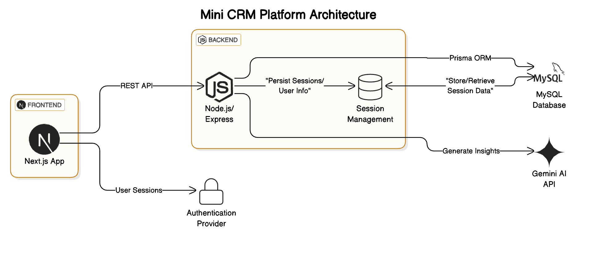

# Mini CRM Platform

This project is a minimal Customer Relationship Management (CRM) platform that supports dynamic audience segmentation, AI-powered campaign insights, and a modern UI/UX stack. Designed with extensibility in mind, this system is ideal for targeted customer communication and engagement.

---

## Features

- Rule-based customer segmentation (e.g., filter by total spend, order count)
- AI-generated insights for each segment using Gemini
- Reusable component architecture (Next.js + ShadCN)
- Modular and containerized backend (Node.js, Express, Prisma)
- Secure authentication and session management

---

## Local Development Setup

### Prerequisites

- Node.js (>=18)
- MySQL
- Docker (optional but recommended)
- Gemini API key (for AI insights)

### Step-by-Step Instructions

1. **Clone the Repository**

   ```bash
   git clone https://github.com/sushmitadas22/mini-crm.git
   cd mini-crm
   ```

2. **Environment Configuration**

    ```bash
    cp .env.template .env
    ```

3. **Add the values in the `.env` file**

4. **Run Database Migrations**

```bash
npx prisma migrate dev --name init
```

5. **Install Dependencies**

```bash
pnpm install
```

6. **Run the Application**

```bash
pnpm dev
```

7. **Start the Worker (for background AI tasks)**

```bash
pnpm worker:start
```

---

Access Points
Frontend: http://localhost:3000

---

## Architecture Diagram



## Technology Stack

### Backend

- Node.js + Express – RESTful API framework
- Prisma ORM – Type-safe database access layer
- MySQL – Relational database
- Gemini API – AI-powered insight generation

### Frontend
- Next.js (App Router) – Full-stack React framework
- ShadCN UI – Accessible and customizable component library
- Lucide Icons – Clean and modern icon set

### AI Tools Used

- Gemini Pro (via Google Generative AI SDK): Used to generate dynamic insights for each segment.


## Known Limitations and Assumptions

- Messaging (e.g., email/SMS) delivery is not implemented — the system only supports preview and insight generation.
- The segmentation rule builder supports a limited set of filters: total_spend, order_count, and last_order_date.

